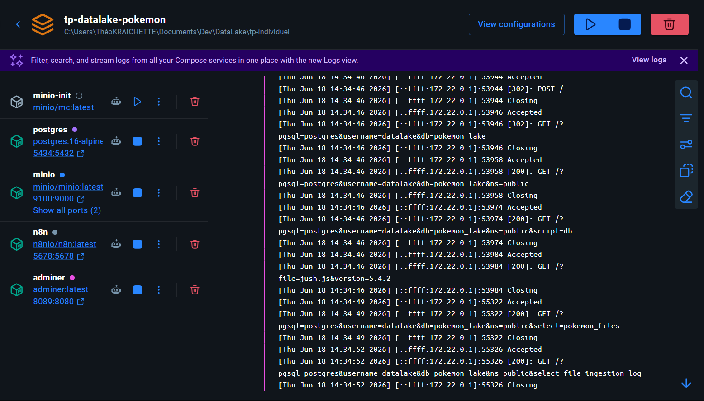
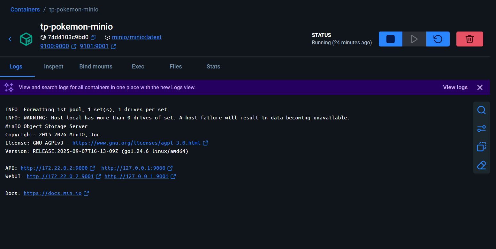
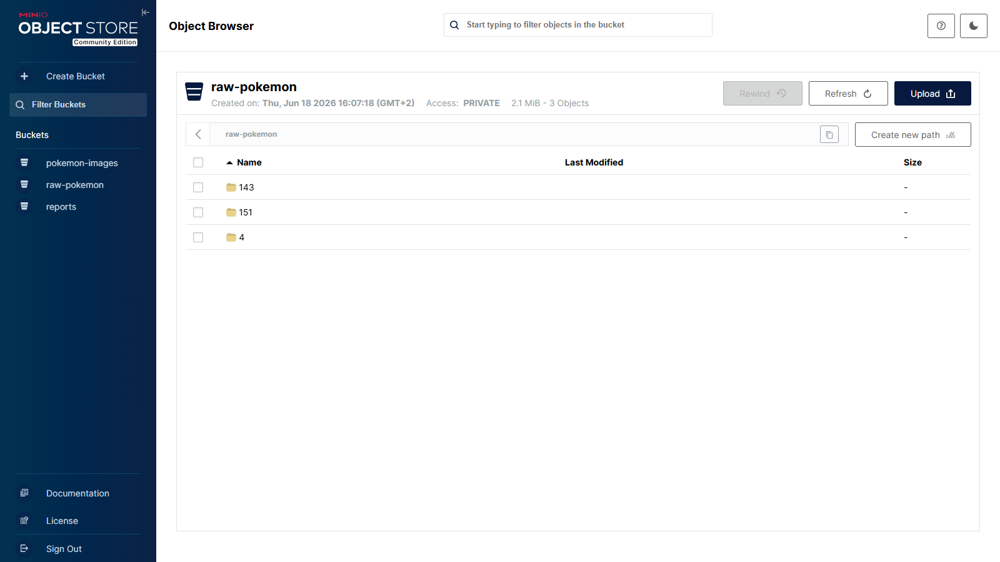
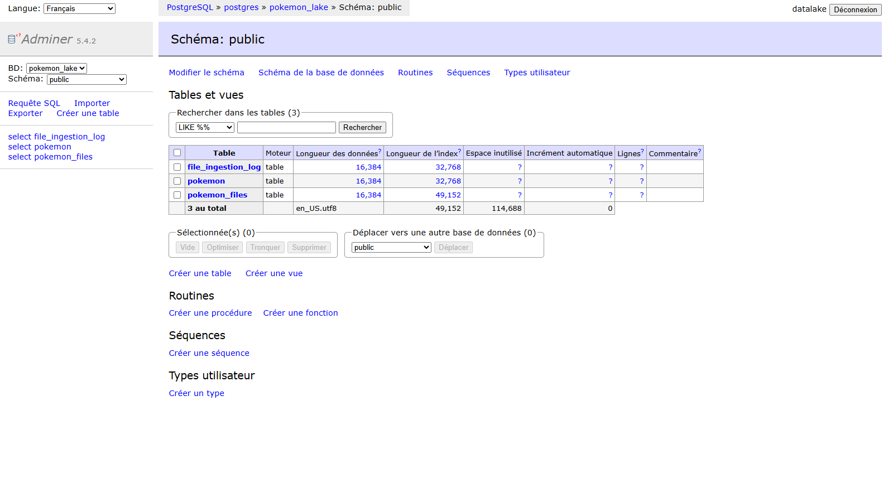
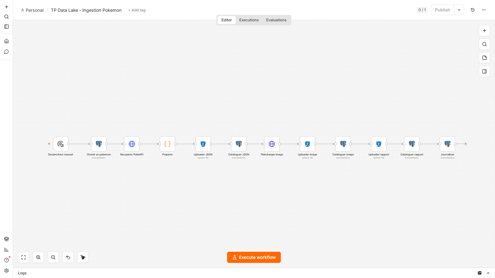
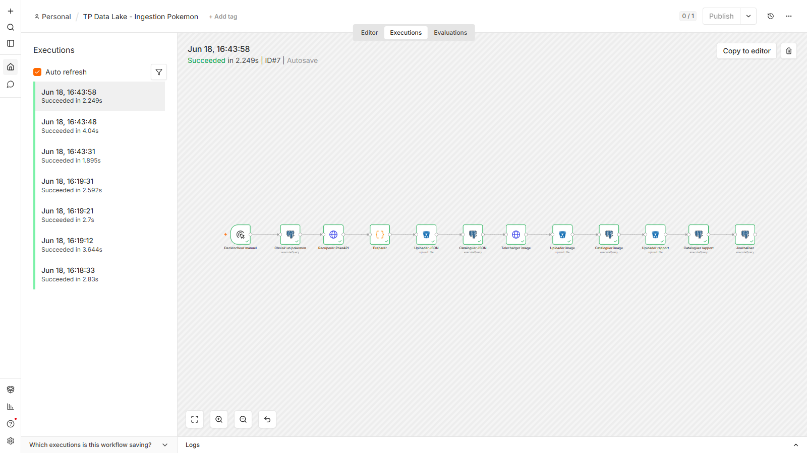
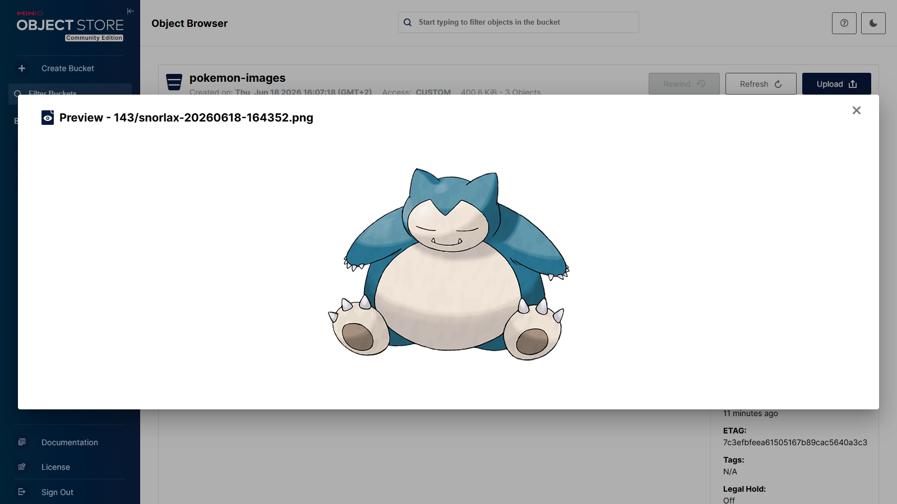
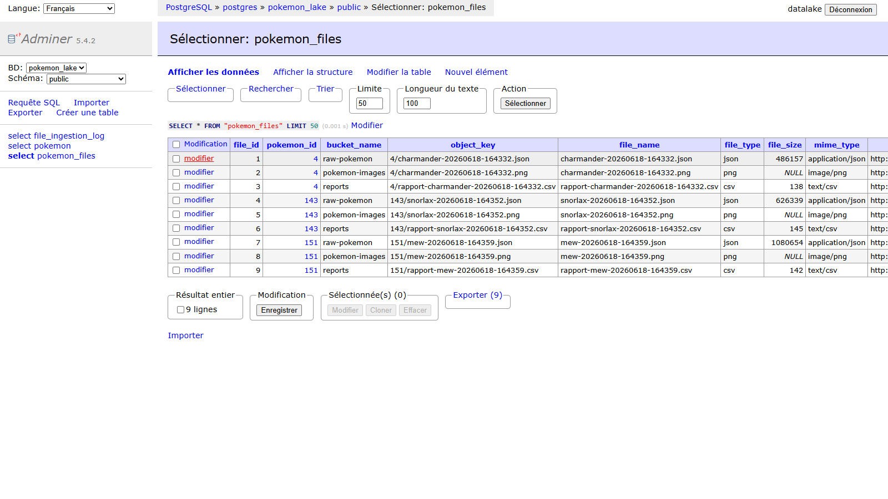
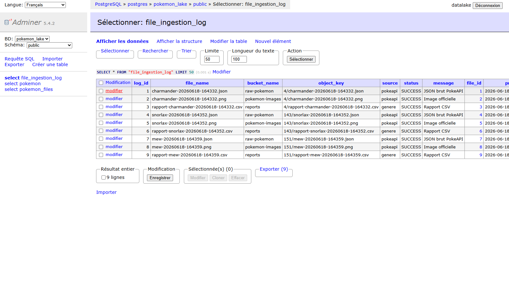

# TP Data Lake — Pokémon

Une base **PostgreSQL** pour les métadonnées, un stockage objet **MinIO** (compatible S3) pour
les fichiers, et un workflow **n8n** qui ingère des données depuis la PokéAPI. La base sait où
sont les fichiers, MinIO les stocke.

```
Pokémon (DB) → PokéAPI → n8n → MinIO (raw-pokemon / pokemon-images / reports)
                              → PostgreSQL (pokemon_files + file_ingestion_log)
```

## Démarrage

```bash
cp .env.example .env          # renseigner les mots de passe avant le premier lancement
docker compose up -d
bash scripts/verifier.sh   # ré-affiche l'état (buckets + base)
```

| Service       | URL                       | Identifiants                            |
|---------------|---------------------------|-----------------------------------------|
| Console MinIO | http://localhost:9101     | `MINIO_ROOT_USER` / `MINIO_ROOT_PASSWORD` (voir `.env`)          |
| n8n           | http://localhost:5678     | compte créé au premier lancement  |
| Adminer (DB)  | http://localhost:8089     | PostgreSQL · `postgres` · identifiants du `.env` |
| PostgreSQL    | localhost:5434            | `POSTGRES_USER` / `POSTGRES_PASSWORD` (voir `.env`) |

Les ports sont décalés en 9100/9101/5434 car 9000/9001 étaient déjà pris par un autre MinIO.
La console MinIO de ce TP est donc sur le **9101**.

---

## 1. MinIO dans l'environnement Docker

Service déclaré dans `docker-compose.yml` :

```yaml
  minio:
    image: minio/minio:latest
    container_name: tp-pokemon-minio
    command: server /data --console-address ":9001"
    ports:
      - "${MINIO_API_PORT}:9000"      # API S3  -> 9100
      - "${MINIO_CONSOLE_PORT}:9001"  # Console  -> 9101
    volumes:
      - minio-data:/data
```





## 2. Buckets et organisation

J'ai choisi **3 buckets séparés** (brut / images / rapports) plutôt qu'un seul, pour des accès
et des cycles de vie distincts. Ils sont créés au démarrage par le service `minio-init` :

```yaml
  minio-init:
    image: minio/mc:latest
    entrypoint: >
      /bin/sh -c "
      mc alias set local http://minio:9000 ${MINIO_ROOT_USER} ${MINIO_ROOT_PASSWORD};
      mc mb -p local/raw-pokemon local/pokemon-images local/reports;
      mc anonymous set download local/pokemon-images; "
```

| Bucket           | Contenu                    |
|------------------|----------------------------|
| `raw-pokemon`    | JSON bruts de la PokéAPI   |
| `pokemon-images` | sprites officiels (PNG)    |
| `reports`        | rapports CSV générés       |

Les objets sont rangés par Pokémon : `<bucket>/<pokemon_id>/<nom>-<timestamp>.<ext>`.



## 3. Structure SQL

Fichier `sql/02_datalake_tables.sql`.

```sql
-- Catalogue : métadonnées + pointeur vers l'objet (pas le fichier)
CREATE TABLE pokemon_files (
    file_id      BIGINT GENERATED ALWAYS AS IDENTITY PRIMARY KEY,
    pokemon_id   INTEGER NOT NULL REFERENCES pokemon(pokemon_id),
    bucket_name  TEXT NOT NULL,
    object_key   TEXT NOT NULL,
    file_name    TEXT NOT NULL,
    file_type    TEXT NOT NULL,
    file_size    BIGINT,
    mime_type    TEXT,
    internal_url TEXT,
    checksum_md5 TEXT,
    ingested_at  TIMESTAMPTZ DEFAULT now(),
    created_at   TIMESTAMPTZ DEFAULT now(),
    CONSTRAINT uq_pokemon_files_object UNIQUE (bucket_name, object_key)
);

-- Journal : une ligne par ingestion
CREATE TABLE file_ingestion_log (
    log_id       BIGINT GENERATED ALWAYS AS IDENTITY PRIMARY KEY,
    file_name    TEXT NOT NULL,
    bucket_name  TEXT,
    object_key   TEXT,
    source       TEXT,
    status       TEXT NOT NULL,          -- SUCCESS | ERROR | SKIPPED
    message      TEXT,
    file_id      BIGINT REFERENCES pokemon_files(file_id),
    processed_at TIMESTAMPTZ DEFAULT now()
);
```



## 4. Workflow n8n

Fichier importable `n8n/workflow_pokemon_datalake.json`. Un run alimente les 3 buckets.

| Étape | Node | Rôle |
|-------|------|------|
| 1 | Déclencheur manuel | démarre le workflow |
| 2 | Choisir un pokemon (Postgres) | tire un Pokémon présent en base |
| 3 | Récupérer PokéAPI (HTTP) | récupère son JSON |
| 4 | Preparer (Code) | clés, taille, MIME, checksum, URL du sprite, CSV |
| 5-6 | Uploader / Cataloguer JSON | JSON → `raw-pokemon` + ligne en base |
| 7-9 | Image → Uploader / Cataloguer | sprite → `pokemon-images` + ligne en base |
| 10-11 | Uploader / Cataloguer rapport | CSV → `reports` + ligne en base |
| 12 | Journaliser | écrit le journal d'ingestion |





## 5. Exemple d'objet stocké

JSON brut déposé dans `raw-pokemon` (extrait — le fichier complet fait ~600 Ko) :

```json
{
  "id": 143,
  "name": "snorlax",
  "height": 21,
  "weight": 4600,
  "types": [
    { "slot": 1, "type": { "name": "normal" } }
  ],
  "stats": [
    { "base_stat": 160, "stat": { "name": "hp" } },
    { "base_stat": 110, "stat": { "name": "attack" } }
  ],
  "sprites": {
    "front_default": "https://raw.githubusercontent.com/PokeAPI/sprites/master/sprites/pokemon/143.png",
    "other": {
      "official-artwork": {
        "front_default": "https://raw.githubusercontent.com/PokeAPI/sprites/master/sprites/pokemon/other/official-artwork/143.png"
      }
    }
  }
}
```

Fichier complet : [`docs/exemple_raw_snorlax.json`](docs/exemple_raw_snorlax.json)

Un sprite ouvert depuis la console MinIO :



Exemple de rapport généré : [`docs/exemple_rapport.csv`](docs/exemple_rapport.csv)

```csv
pokemon_id,name,types,height,weight,stats
143,snorlax,normal,21,4600,hp=160;attack=110;defense=65;special-attack=65;special-defense=110;speed=30
```

## 6. Métadonnées en base

Catalogue `pokemon_files` (taille, type, checksum, URL interne, lien Pokémon) :



Journal `file_ingestion_log` (source, statut, lien vers le fichier) :



## 7. Réponse à la question

**Pourquoi cette architecture ressemble plus à un Data Lake / Lakehouse qu'une simple bdd'?**

Le soucis d'avoir juste une base PostgreSQL c'est que ce n'est pas fait pour
stocker de gros fichiers : un JSON ou une image de 1 Mo, ça l'alourdit et ça la ralentit. MinIO
règle ça : c'est un espace à part, pensé pour garder n'importe quel fichier quelle que soit sa
taille. Les deux se complètent, chacun fait ce qu'il sait faire le mieux. On garde aussi les
fichiers bruts tels que la PokéAPI nous les envoie, parce qu'on ne sait pas encore tout ce qu'on
voudra en faire plus tard — avec l'original, on peut toujours re-traiter sans tout
re-télécharger. Du coup la base ne contient plus le fichier, juste sa fiche d'identité (où il
est rangé, sa taille, son type, son lien vers le Pokémon) ; le fichier, lui, vit dans MinIO.
C'est plus riche qu'une simple base : tous les formats, sans limite de taille, l'historique
brut conservé, et tout reste relié proprement. C'est l'esprit d'un Data Lake.

---

## Structure du projet

```
tp-individuel/
├── docker-compose.yml          # MinIO + Postgres + n8n + Adminer + init buckets
├── .env                        # identifiants & ports
├── sql/                        # pokemon (seed) + pokemon_files + file_ingestion_log
├── n8n/                        # workflow + credentials (importables)
├── scripts/verifier.sh         # ré-affiche les preuves
├── docs/                       # captures d'écran + objets exemples (JSON, CSV)
└── README.md
```

Ré-importer puis exécuter le workflow :

```bash
docker exec tp-pokemon-n8n n8n import:credentials --input=/import/credentials.json
docker exec tp-pokemon-n8n n8n import:workflow    --input=/import/workflow_pokemon_datalake.json
docker exec -e N8N_RUNNERS_BROKER_PORT=5699 tp-pokemon-n8n n8n execute --id tpdatalakepokemon01
```

